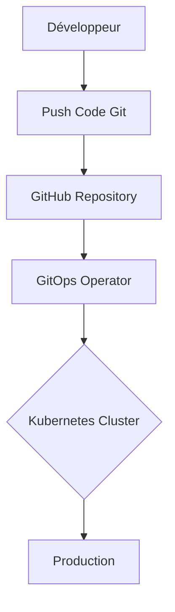

# 🔧 Git & GitHub pour DevOps - Le Cœur du Versioning


## 📖 Table des Matières
- [🎯 Pourquoi Git/GitHub en DevOps?](#-pourquoi-gitgithub-en-devops)
- [🚀 Workflow GitOps](#-workflow-gitops)
- [🔧 Compétences Git DevOps](#-compétences-git-devops)
- [🏗️ Structure des Projets](#️-structure-des-projets)
- [📁 Projet 1 : Pipeline GitOps](#-projet-1--pipeline-gitops)
- [⚡ Projet 2 : CI/CD Automatisé](#-projet-2--cicd-automatisé)
- [🔒 Projet 3 : Sécurité Git](#-projet-3--sécurité-git)
- [🤖 Projet 4 : Automatisation GitHub](#-projet-4--automatisation-github)
- [📊 Métriques d'Évaluation](#-métriques-dévaluation)
- [🎓 Pour les Formateurs](#-pour-les-formateurs)
- [📚 Ressources](#-ressources)

## 🎯 Pourquoi Git/GitHub en DevOps?

### **La Réalité DevOps 2026**
```bash
# Statistiques clés
100% des entreprises DevOps utilisent Git
89% utilisent GitHub comme plateforme principale
72% ont adopté GitOps comme méthodologie
```

### **7 Raisons Fondamentales Git en DevOps**

| Raison | Impact DevOps | Exemple Concret |
|--------|--------------|-----------------|
| **1. Infrastructure as Code** | Versioning de l'infrastructure | Terraform dans Git |
| **2. GitOps** | Déploiements pilotés par Git | Flux/ArgoCD |
| **3. Collaboration** | Multi-équipes, multi-env | Pull Requests |
| **4. CI/CD Natif** | Intégration GitHub Actions | .github/workflows |
| **5. Audit Trail** | Conformité & traçabilité | Git log --oneline |
| **6. Rollback** | Revenir à n'importe quel état | git revert |
| **7. Documentation** | Docs versionnées avec le code | README.md |

### **GitOps : Le Paradigme DevOps Moderne**


## 🚀 Workflow Git DevOps

### **Flow Standard DevOps**
```bash
# 1. Feature Branch
git checkout -b feature/aws-integration

# 2. Commit IaC & App
git add terraform/ app/
git commit -m "feat: add AWS RDS infrastructure"

# 3. Push & PR
git push origin feature/aws-integration
# → Créer Pull Request sur GitHub

# 4. CI/CD Automatique
# GitHub Actions: test, build, security scan

# 5. Review & Merge
# Approbation équipe + Merge

# 6. Déploiement Automatique
# GitOps déploie en production
```

### **Branches DevOps Recommandées**
```bash
main                    # Production
├── staging             # Pré-production
├── develop             # Développement
├── feature/*           # Nouvelles fonctionnalités
├── hotfix/*           # Correctifs urgents
└── release/*          Préparations release
```

## 🔧 Compétences Git DevOps

### **Niveau 1 : Développeur DevOps**
```bash
✅ Git basics (clone, add, commit, push)
✅ Branches & merges
✅ Pull Requests
✅ .gitignore patterns
✅ GitHub basics (issues, projects)
```

### **Niveau 2 : Ingénieur DevOps**
```bash
⭐ Git hooks (pre-commit, pre-push)
⭐ Submodules & subtrees
⭐ Git flow avancé
⭐ GitHub Actions workflows
⭐ GitHub API & automations
```

### **Niveau 3 : Architecte DevOps**
```bash
🔥 GitOps patterns (Flux, ArgoCD)
🔥 Multi-repo vs mono-repo stratégies
🔥 Security scanning (GitLeaks, TruffleHog)
🔥 Performance Git (shallow clone, sparse checkout)
🔥 GitHub Enterprise administration
```

## 🏗️ Structure des Projets

```
git-devops-mastery/
├── 📁 01-gitops-pipeline/
│   ├── infrastructure/
│   │   ├── terraform/
│   │   └── kubernetes/
│   ├── applications/
│   │   ├── backend/
│   │   └── frontend/
│   └── .github/workflows/
│       ├── ci.yaml
│       ├── cd.yaml
│       └── security.yaml
│
├── 📁 02-cicd-automation/
│   ├── docker/
│   │   └── Dockerfile
│   ├── scripts/
│   │   ├── deploy.sh
│   │   └── rollback.sh
│   └── environments/
│       ├── dev/
│       ├── staging/
│       └── prod/
│
├── 📁 03-git-security/
│   ├── pre-commit-hooks/
│   ├── gitleaks-config/
│   └── audit-scripts/
│
├── 📁 04-github-automation/
│   ├── actions/
│   ├── scripts/
│   └── templates/
│
├── 📁 05-advanced-patterns/
│   ├── monorepo-setup/
│   ├── submodules-example/
│   └── release-automation/
│
└── 📁 labs/
    ├── lab1-branching/
    ├── lab2-conflicts/
    ├── lab3-hooks/
    └── lab4-actions/
```

## 📁 Projet 1 : Pipeline GitOps

### **Objectif** : Mettre en place un pipeline GitOps complet
```bash
# Structure GitOps Recommandée
my-application/
├── .github/
│   └── workflows/
│       ├── terraform-apply.yaml    # Déploiement IaC
│       ├── kubernetes-sync.yaml    # Sync K8s manifests
│       └── security-scan.yaml      # Scan de sécurité
├── infrastructure/
│   ├── terraform/
│   │   ├── main.tf
│   │   ├── variables.tf
│   │   └── outputs.tf
│   └── kubernetes/
│       ├── deployment.yaml
│       ├── service.yaml
│       └── ingress.yaml
├── applications/
│   ├── backend/
│   └── frontend/
└── README.md
```

### **.gitignore pour DevOps**
```gitignore
# Fichiers sensibles
.env
*.pem
*.key
secrets*.yaml

# Terraform
.terraform/
*.tfstate
*.tfstate.backup

# Docker
docker-compose.override.yml

# Kubernetes
kubeconfig

# OS
.DS_Store
Thumbs.db

# IDE
.vscode/
.idea/
*.swp
```

### **Workflow GitOps avec GitHub Actions**
```yaml
# .github/workflows/gitops.yaml
name: GitOps Pipeline
on:
  push:
    branches: [ main ]

jobs:
  terraform:
    runs-on: ubuntu-latest
    steps:
      - uses: actions/checkout@v3
      
      - name: Terraform Apply
        uses: hashicorp/setup-terraform@v2
        with:
          terraform_version: 1.5.0
          
      - run: terraform init
      - run: terraform apply -auto-approve

  kubernetes:
    needs: terraform
    runs-on: ubuntu-latest
    steps:
      - uses: actions/checkout@v3
      
      - name: Deploy to Kubernetes
        uses: azure/k8s-deploy@v1
        with:
          namespace: production
          manifests: infrastructure/kubernetes/
```

## ⚡ Projet 2 : CI/CD Automatisé

### **Pipeline CI/CD Multi-Environnements**
```yaml
# .github/workflows/full-cicd.yaml
name: Full CI/CD Pipeline

on:
  pull_request:
    branches: [ main, develop ]
  push:
    branches: [ main ]

jobs:
  test:
    runs-on: ubuntu-latest
    strategy:
      matrix:
        python-version: ["3.9", "3.10", "3.11"]
    
    steps:
    - uses: actions/checkout@v3
    
    - name: Set up Python ${{ matrix.python-version }}
      uses: actions/setup-python@v4
      with:
        python-version: ${{ matrix.python-version }}
    
    - name: Install dependencies
      run: pip install -r requirements.txt
      
    - name: Run tests
      run: pytest --cov=./ --cov-report=xml
  
  build-and-push:
    needs: test
    runs-on: ubuntu-latest
    if: github.event_name == 'push' && github.ref == 'refs/heads/main'
    
    steps:
    - uses: actions/checkout@v3
    
    - name: Log in to Docker Hub
      uses: docker/login-action@v2
      with:
        username: ${{ secrets.DOCKER_USERNAME }}
        password: ${{ secrets.DOCKER_PASSWORD }}
    
    - name: Build and push
      uses: docker/build-push-action@v4
      with:
        push: true
        tags: |
          user/app:latest
          user/app:${{ github.sha }}
  
  deploy:
    needs: build-and-push
    runs-on: ubuntu-latest
    environment: production
    
    steps:
    - uses: actions/checkout@v3
    
    - name: Deploy to Kubernetes
      run: |
        echo "${{ secrets.KUBECONFIG }}" | base64 -d > kubeconfig
        export KUBECONFIG=kubeconfig
        kubectl apply -f k8s/
        kubectl rollout status deployment/app
```

### **Script de Déploiement Blue-Green**
```bash
#!/bin/bash
# blue-green-deploy.sh

set -e

APP="myapp"
VERSION="$1"
NAMESPACE="production"

# Déploiement Green
echo "🚀 Deploying Green environment..."
kubectl apply -f k8s/green-deployment.yaml
kubectl apply -f k8s/green-service.yaml

# Attente que Green soit ready
echo "⏳ Waiting for Green to be ready..."
kubectl rollout status deployment/${APP}-green -n $NAMESPACE --timeout=300s

# Switch du trafic
echo "🔄 Switching traffic to Green..."
kubectl patch service $APP -n $NAMESPACE -p '{"spec":{"selector":{"version":"'$VERSION'"}}}'

# Cleanup Blue
echo "🧹 Cleaning up Blue..."
kubectl delete deployment ${APP}-blue -n $NAMESPACE --ignore-not-found=true

echo "✅ Blue-Green deployment completed!"
```

## 🔒 Projet 3 : Sécurité Git

### **Pre-commit Hooks pour DevOps**
```yaml
# .pre-commit-config.yaml
repos:
  - repo: https://github.com/pre-commit/pre-commit-hooks
    rev: v4.4.0
    hooks:
      - id: trailing-whitespace
      - id: end-of-file-fixer
      - id: check-yaml
      - id: check-json
  
  - repo: https://github.com/terraform-docs/terraform-docs
    rev: v0.16.0
    hooks:
      - id: terraform-docs-go
        args: [--output-file, README.md, --output-mode, inject]
  
  - repo: https://github.com/antonbabenko/pre-commit-terraform
    rev: v1.77.0
    hooks:
      - id: terraform_fmt
      - id: terraform_validate
      - id: terraform_docs
      - id: terraform_tflint
  
  - repo: https://github.com/gitleaks/gitleaks
    rev: v8.16.1
    hooks:
      - id: gitleaks
  
  - repo: https://github.com/Yelp/detect-secrets
    rev: v1.4.0
    hooks:
      - id: detect-secrets
        args: ['--baseline', '.secrets.baseline']
```

### **Scan de Sécurité Automatisé**
```bash
#!/bin/bash
# security-scan.sh

echo "🔒 Starting Git Security Scan"
echo "============================="

# 1. Scan for secrets
echo "Scanning for secrets..."
gitleaks detect --source . --verbose --redact

# 2. Check dependencies
echo "Scanning dependencies..."
trivy fs --security-checks vuln,config .

# 3. Infrastructure as Code scanning
echo "Scanning IaC..."
checkov -d .
tfsec .

# 4. Commit history scan
echo "Scanning commit history..."
git log --all -p | grep -E "AKIA[0-9A-Z]{16}|[0-9a-f]{32}" | head -20

echo "✅ Security scan completed!"
```

### **GitHub Security Features**
```yaml
# .github/dependabot.yml
version: 2
updates:
  - package-ecosystem: "npm"
    directory: "/"
    schedule:
      interval: "weekly"
    labels:
      - "security"
      - "dependencies"
  
  - package-ecosystem: "docker"
    directory: "/"
    schedule:
      interval: "weekly"
  
  - package-ecosystem: "github-actions"
    directory: "/"
    schedule:
      interval: "weekly"
```

## 🤖 Projet 4 : Automatisation GitHub

### **GitHub Actions pour DevOps**
```yaml
# .github/workflows/devops-automation.yaml
name: DevOps Automation

on:
  schedule:
    - cron: '0 8 * * 1-5'  # Weekdays at 8 AM
  workflow_dispatch:

jobs:
  cleanup:
    runs-on: ubuntu-latest
    steps:
      - name: Cleanup old Docker images
        run: |
          docker system prune -af
      
      - name: Cleanup Kubernetes resources
        env:
          KUBECONFIG: ${{ secrets.KUBECONFIG }}
        run: |
          kubectl delete pods --field-selector=status.phase==Succeeded --all-namespaces
          kubectl delete jobs --field-selector=status.successful==1 --all-namespaces
  
  backup:
    runs-on: ubuntu-latest
    steps:
      - name: Backup databases
        run: |
          # Backup PostgreSQL
          pg_dump $DB_URL > backup_$(date +%Y%m%d).sql
          
          # Upload to S3
          aws s3 cp backup_*.sql s3://my-backups/
  
  monitoring:
    runs-on: ubuntu-latest
    steps:
      - name: Check cluster health
        env:
          KUBECONFIG: ${{ secrets.KUBECONFIG }}
        run: |
          kubectl get nodes
          kubectl get pods --all-namespaces | grep -v Running
```

### **Templates de Pull Requests**
```yaml
# .github/PULL_REQUEST_TEMPLATE.md
## Description
<!--- Décrivez vos changements en détail -->

## Type de changement
- [ ] Bug fix
- [ ] Nouvelle fonctionnalité
- [ ] Changement breaking
- [ ] Documentation

## Checklist DevOps
- [ ] Tests ajoutés/mis à jour
- [ ] Documentation mise à jour
- [ ] Scan de sécurité effectué
- [ ] Images Docker taggées correctement
- [ ] Variables d'environnement documentées
- [ ] Terraform plan validé
- [ ] Backward compatibility vérifiée

## Environnements affectés
- [ ] Développement
- [ ] Staging
- [ ] Production

## Screenshots (si applicable)

## Informations supplémentaires
```

### **GitHub API pour l'Automatisation**
```python
#!/usr/bin/env python3
# github-automation.py

import requests
import os
from datetime import datetime, timedelta

GITHUB_TOKEN = os.getenv('GITHUB_TOKEN')
REPO = "org/repo"
HEADERS = {
    "Authorization": f"token {GITHUB_TOKEN}",
    "Accept": "application/vnd.github.v3+json"
}

def cleanup_old_branches():
    """Supprime les branches non mergées après 30 jours"""
    url = f"https://api.github.com/repos/{REPO}/branches"
    
    response = requests.get(url, headers=HEADERS)
    branches = response.json()
    
    for branch in branches:
        branch_name = branch['name']
        if branch_name not in ['main', 'develop', 'staging']:
            # Vérifier dernière activité
            prs_url = f"https://api.github.com/repos/{REPO}/pulls"
            params = {"state": "all", "head": branch_name}
            
            pr_response = requests.get(prs_url, headers=HEADERS, params=params)
            prs = pr_response.json()
            
            if not prs:
                # Pas de PR, vérifier dernier commit
                commit_url = f"https://api.github.com/repos/{REPO}/commits"
                params = {"sha": branch_name, "per_page": 1}
                
                commit_response = requests.get(commit_url, headers=HEADERS, params=params)
                if commit_response.json():
                    last_commit_date = commit_response.json()[0]['commit']['author']['date']
                    commit_date = datetime.fromisoformat(last_commit_date.replace('Z', '+00:00'))
                    
                    if datetime.now() - commit_date > timedelta(days=30):
                        print(f"Deleting stale branch: {branch_name}")
                        delete_url = f"https://api.github.com/repos/{REPO}/git/refs/heads/{branch_name}"
                        requests.delete(delete_url, headers=HEADERS)

if __name__ == "__main__":
    cleanup_old_branches()
```

## 📊 Métriques d'Évaluation

### **Checklist de Compétences Git DevOps**
```bash
# Score votre niveau (/100 points)

□ 01. Maîtrise des commandes Git de base (5pts)
□ 02. Workflow branching stratégique (5pts)
□ 03. Résolution de conflits complexes (5pts)
□ 04. Git hooks configuration (5pts)
□ 05. GitHub Actions workflows (5pts)
□ 06. Pull Requests avec templates (5pts)
□ 07. Sécurité Git (pre-commit, gitleaks) (5pts)
□ 08. GitOps principles implementation (5pts)
□ 09. Multi-repo vs mono-repo stratégie (5pts)
□ 10. Submodules & subtrees (5pts)
□ 11. GitHub API automation (5pts)
□ 12. CI/CD pipeline configuration (5pts)
□ 13. Rollback strategies (5pts)
□ 14. Git Large File Storage (LFS) (5pts)
□ 15. Performance optimization (5pts)
□ 16. Backup & disaster recovery (5pts)
□ 17. Code review best practices (5pts)
□ 18. Documentation in Git (5pts)
□ 19. Release management (5pts)
□ 20. Team collaboration workflows (5pts)
```

### **Certifications Recommandées**
1. **GitHub Foundations Certification**
2. **GitLab Certified Associate**
3. **Atlassian Git Certification**

## 🎓 Pour les Formateurs

### **Structure du Module Git/GitHub**
```
Semaine 1: Git Fundamentals
├── Version control concepts
├── Basic commands & workflow
└── Branching strategies

Semaine 2: Collaboration avec GitHub
├── Pull Requests & code review
├── Issues & Projects
└── GitHub Pages

Semaine 3: DevOps Integration
├── GitHub Actions CI/CD
├── Security scanning
└── GitOps introduction

Semaine 4: Advanced Patterns
├── Monorepo management
├── Automation scripts
└── Enterprise features
```

### **Exercices Pratiques pour la Classe**
```bash
# Exercice 1: Git Merge Conflict Resolution
# Donné: Branches avec conflits Terraform
# Objectif: Résoudre conflits proprement

# Exercice 2: Pipeline CI/CD from scratch
# Créer un pipeline qui:
# 1. Test sur PR
# 2. Build Docker image
# 3. Scan sécurité
# 4. Déploie sur K8s

# Exercice 3: Security Incident Response
# Un secret a été commité accidentellement
# 1. Trouver le secret
# 2. Révoquer le secret
# 3. Nettoyer l'historique
# 4. Prévenir la récidive
```

### **Projet Final: Platform GitOps**
```markdown
## Objectif
Créer une plateforme GitOps complète avec:
- Infrastructure as Code (Terraform)
- Applications containerisées
- CI/CD pipeline
- Monitoring & alerting
- Security scanning

## Livrables
1. Repository GitHub avec structure DevOps
2. Documentation complète
3. Pipeline fonctionnel
4. Démo de déploiement
```

## 📚 Ressources

### **Livres Essentiels**
1. **"Pro Git"** - Scott Chacon & Ben Straub
2. **"GitOps and Kubernetes"** - Billy Yuen
3. **"The GitHub Handbook"** - Chris Dawson

### **Cours en Ligne**
- [GitHub Skills](https://skills.github.com/)
- [GitLab University](https://about.gitlab.com/handbook/gitlab-university/)
- [Atlassian Git Tutorials](https://www.atlassian.com/git)

### **Outils DevOps Git**
```bash
# Command-line tools
gh          # GitHub CLI
git-flow    # Git branching model
lazygit     # TUI for Git
tig         # Text-mode interface

# Security tools
gitleaks    # Secret detection
trufflehog  # High entropy scanning
git-secrets # AWS secret prevention

# Automation
hub         # GitHub wrapper
gitpython   # Python library
octokit     # GitHub SDKs
```

### **Communautés**
- [GitHub Community](https://github.com/community/community)
- [GitLab Forum](https://forum.gitlab.com/)
- [r/git](https://www.reddit.com/r/git/)


**⚠️ Rappel Important** : Git n'est pas juste un outil de versioning, c'est le **système nerveux central** de votre pipeline DevOps. Chaque changement d'infrastructure, chaque configuration, chaque déploiement devrait passer par Git.

**🌟 Conseil** : Adoptez le principe "Everything as Code" - si ce n'est pas dans Git, ça n'existe pas!


**💡 Astuce DevOps** : 
```bash
# Alias Git pour DevOps
echo "alias gs='git status'" >> ~/.bashrc
echo "alias gpr='git pull --rebase'" >> ~/.bashrc
echo "alias gca='git commit --amend --no-edit'" >> ~/.bashrc
echo "alias gclean='git branch --merged | grep -v \"\\*\" | xargs -n 1 git branch -d'" >> ~/.bashrc
source ~/.bashrc
```

*"En DevOps, Git est votre source de vérité unique. Traitez-le avec le respect qu'il mérite."*


