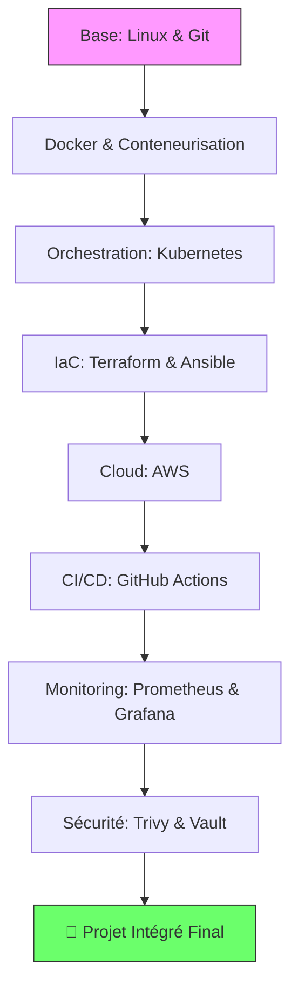

#  Roadmap DevOps de Novice a Expert - Projets Pratiques


## 📖 Table des Matières
- [🎯 Objectif](#-objectif)
- [📊 Roadmap Visuelle](#-roadmap-visuelle)
- [🔧 Stack Technologique](#-stack-technologique)
- [📁 Structure des Projets](#-structure-des-projets)
- [🚀 Projets par Niveau](#-projets-par-niveau)
- [🔍 Détails des Outils](#-détails-des-outils)
- [📈 Compétences Acquises](#-compétences-acquises)
- [🎓 Pour Formateurs](#-pour-formateurs)
- [🤝 Contribution](#-contribution)
- [📜 Licence](#-licence)

## 🎯 Objectif

Cette roadmap a pour but de transformer un développeur,AdminSys,Inginieur Reseau,etc... en **expert DevOps** à travers des projets pratiques couvrant l'ensemble du cycle de vie des applications. Chaque projet est conçu pour être **production-ready** et enseignable.

## 📊 Roadmap Visuelle



## 🔧 Stack Technologique

| Catégorie | Outils Principaux | Alternatives |
|-----------|------------------|--------------|
| **Conteneurs** | Docker, Docker Compose | Podman, Containerd |
| **Orchestration** | Kubernetes, Helm | Nomad, Docker Swarm |
| **Infrastructure as Code** | Terraform, Ansible | Pulumi, Chef, Puppet |
| **Cloud** | AWS | Azure, GCP, OVH Cloud |
| **CI/CD** | GitHub Actions | GitLab CI, Jenkins, CircleCI |
| **Monitoring** | Prometheus, Grafana | Datadog, New Relic, Zabbix |
| **Sécurité** | Trivy, Vault, AWS Secrets Manager | Snyk, Azure Key Vault, HashiCorp Boundary |
| **Système** | Linux, Bash, Git | Windows Server, PowerShell |

## 📁 Structure des Projets

```
devops-roadmap/
├── 📁 01-docker-basics/
│   ├── README.md
│   ├── docker-compose.yml
│   ├── Dockerfile
│   └── scripts/
├── 📁 02-kubernetes-cluster/
│   ├── manifests/
│   ├── helm-charts/
│   └── terraform/
├── 📁 03-ci-cd-pipeline/
│   ├── .github/workflows/
│   ├── app/
│   └── tests/
├── 📁 04-monitoring-stack/
│   ├── prometheus/
│   ├── grafana/
│   └── alertmanager/
└── 📁 05-security-compliance/
    ├── trivy-scans/
    ├── vault-config/
    └── policies/
```

## 🚀 Projets par Niveau

### 🟢 **Niveau 1 : Fondamentaux** (Projets 1-5)
- **P1** : Environnement Docker multi-services
- **P2** : Cluster Kubernetes local (Minikube/Kind)
- **P3** : Pipeline CI/CD basique
- **P4** : Infrastructure AWS avec Terraform
- **P5** : Configuration serveurs avec Ansible

### 🟡 **Niveau 2 : Intermédiaire** (Projets 6-12)
- **P6** : Monitoring avec Prometheus/Grafana
- **P7** : Sécurité des conteneurs avec Trivy
- **P8** : Gestion des secrets avec Vault
- **P9** : Auto-scaling sur AWS
- **P10** : Service Mesh avec Istio
- **P11** : GitOps avec ArgoCD
- **P12** : Logging centralisé avec ELK

### 🔴 **Niveau 3 : Avancé** (Projets 13-20)
- **P13** : Multi-cloud strategy
- **P14** : Chaos Engineering
- **P15** : Disaster Recovery
- **P16** : Cost Optimization
- **P17** : Compliance as Code
- **P18** : Platform Engineering
- **P19** : Serverless Architecture
- **P20** : **Projet intégré final**

## 🔍 Détails des Outils

### **1. 🐳 Docker & Conteneurisation**
**Compétences acquises** :
- Création d'images Docker optimisées
- Réseaux et volumes Docker
- Docker Compose pour multi-conteneurs
- Best practices de sécurité

**Pourquoi c'est utile** :
- Isolation des applications
- Reproducibilité des environnements
- Facilite le déploiement

**Outils similaires** : Podman, Containerd, LXC

### **2. ☸️ Kubernetes**
**Compétences acquises** :
- Déploiement d'applications stateless/stateful
- Gestion du networking (Services, Ingress)
- Stockage persistant (PV/PVC)
- Auto-scaling (HPA, Cluster Autoscaler)

**Pourquoi c'est utile** :
- Orchestration de conteneurs à grande échelle
- Auto-healing et résilience
- Portabilité cloud/on-premise

**Outils similaires** : Docker Swarm, Nomad, OpenShift

### **3. 🔄 GitHub Actions**
**Compétences acquises** :
- Création de workflows CI/CD
- Gestion des secrets et contextes
- Matrices de builds et tests parallèles
- Intégration avec les webhooks

**Pourquoi c'est utile** :
- Automatisation du développement
- Intégration native avec GitHub
- Large marketplace d'actions

**Outils similaires** : GitLab CI, Jenkins, CircleCI, Azure DevOps

### **4. 🏗️ Terraform**
**Compétences acquises** :
- Infrastructure as Code (IaC)
- Modules réutilisables
- State management
- Plan/Apply workflow

**Pourquoi c'est utile** :
- Infrastructure versionnée
- Reproducibilité des environnements
- Gestion multi-cloud

**Outils similaires** : AWS CDK, Pulumi, CloudFormation

### **5. ⚙️ Ansible**
**Compétences acquises** :
- Configuration management
- Playbooks idempotents
- Rôles réutilisables
- Inventaires dynamiques

**Pourquoi c'est utile** :
- Automatisation de la configuration
- Support multi-OS
- Architecture agentless

**Outils similaires** : Chef, Puppet, SaltStack

### **6. ☁️ AWS**
**Compétences acquises** :
- Services compute (EC2, Lambda, ECS/EKS)
- Stockage (S3, EBS, EFS)
- Networking (VPC, Route53, ALB)
- Database (RDS, DynamoDB)

**Pourquoi c'est utile** :
- Leader du marché cloud
- Écosystème complet
- Grande communauté

**Outils similaires** : Azure, Google Cloud Platform, OVH Cloud

### **7. 📊 Prometheus**
**Compétences acquises** :
- Collecte de métriques time-series
- Alerting rules
- Service discovery
- Exporters custom

**Pourquoi c'est utile** :
- Monitoring Kubernetes natif
- Open-source et extensible
- Intégration avec Grafana

**Outils similaires** : Datadog, New Relic, Zabbix

### **8. 📈 Grafana**
**Compétences acquises** :
- Création de dashboards
- Alerting multi-canaux
- Data sources divers
- Annotations et templating

**Pourquoi c'est utile** :
- Visualisation centralisée
- Interface utilisateur riche
- Large communauté de dashboards

**Outils similaires** : Kibana, Chronograf, Datadog Dashboards

### **9. 🔒 Trivy**
**Compétences acquises** :
- Scan de vulnérabilités CVE
- Configuration security
- Intégration CI/CD
- Politiques de sécurité

**Pourquoi c'est utile** :
- Sécurité Shift Left
- Scanner open-source complet
- Support multi-langages

**Outils similaires** : Snyk, Clair, AWS Inspector

### **10. 🗝️ Vault & AWS Secrets Manager**
**Compétences acquises** :
- Gestion centralisée des secrets
- Rotation automatique
- Dynamic secrets
- Audit trails

**Pourquoi c'est utile** :
- Sécurité des credentials
- Conformité réglementaire
- Intégration cloud native

**Outils similaires** : Azure Key Vault, Google Secret Manager, CyberArk

## 📈 Compétences Acquises

### **Hard Skills**
- ✅ Infrastructure as Code (Terraform, Ansible)
- ✅ Conteneurisation et Orchestration
- ✅ CI/CD Pipelines automatisés
- ✅ Monitoring et Observabilité
- ✅ Sécurité DevSecOps
- ✅ Cloud Computing (AWS)
- ✅ Gestion des Configurations
- ✅ Automatisation des déploiements

### **Soft Skills**
- ✅ Résolution de problèmes complexes
- ✅ Travail en équipe agile
- ✅ Documentation technique
- ✅ Communication claire
- ✅ Gestion du temps
- ✅ Adaptabilité

## 🎓 Pour Formateurs

### **Structure de Cours Recommandée**

#### **Module 1 : Introduction DevOps** (2 semaines)
- Culture DevOps et bonnes pratiques
- Introduction aux conteneurs

#### **Module 2 : Conteneurisation** (3 semaines)
- Docker approfondi
- Best practices sécurité

#### **Module 3 : Orchestration** (4 semaines)
- Kubernetes fondamentaux
- Helm et package management

#### **Module 4 : Infrastructure as Code** (3 semaines)
- Terraform pour le cloud
- Ansible pour la configuration

#### **Module 5 : CI/CD** (2 semaines)
- GitHub Actions avancé
- Stratégies de déploiement

#### **Module 6 : Monitoring** (2 semaines)
- Stack Prometheus/Grafana
- Alerting et SLOs

#### **Module 7 : Sécurité** (2 semaines)
- Sécurité des conteneurs
- Gestion des secrets

#### **Module 8 : Projet Final** (3 semaines)
- Intégration complète

### **Évaluation des Apprenants**
1. **Projets pratiques** (60%)
2. **Quiz théoriques** (20%)
3. **Présentation technique** (10%)
4. **Contribution open source** (10%)

### **Ressources Pédagogiques**
- Slides pour chaque module
- Labs pratiques avec solutions
- Environnements sandbox
- Checklist de compétences
- Templates de projets

## 🤝 Contribution

Les contributions sont les bienvenues ! Pour contribuer :

1. Fork le projet
2. Crée une branche (`git checkout -b feature/AmazingFeature`)
3. Commit les changements (`git commit -m 'Add some AmazingFeature'`)
4. Push vers la branche (`git push origin feature/AmazingFeature`)
5. Ouvre une Pull Request

### **Guide de Contribution**
- Suivre la structure existante
- Ajouter des tests pour les nouvelles fonctionnalités
- Mettre à jour la documentation
- Respecter les conventions de code

## 📜 Licence

Ce projet est sous licence MIT. Voir le fichier [LICENSE](LICENSE) pour plus de détails.

## ✨ aide

```bash
# Si vous utilisez cette roadmap dans votre travail, citez-la :
DevOps Roadmap Expert - Formation Complète
https://github.com/Moreldev237/Mon_parcours_devops.git
```

## 🌟 Support

Si vous appréciez ce projet, donnez-lui une ⭐ sur GitHub !

## 📞 Contact

Pour des questions ou du support :
- 📧 Email : nkongamorel1@gmail.com
- 💼 TikTok : @Morel
- 💼 LinkedIn : linkedin.com/in/morel-nkonga-5617a32a8/


**⭐ N'oubliez pas de donner une étoile si ce projet vous a aidé ! ⭐**

*Dernière mise à jour : $(date)*